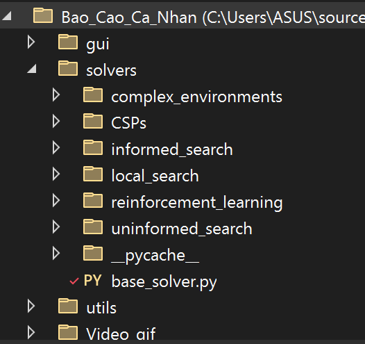
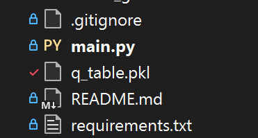
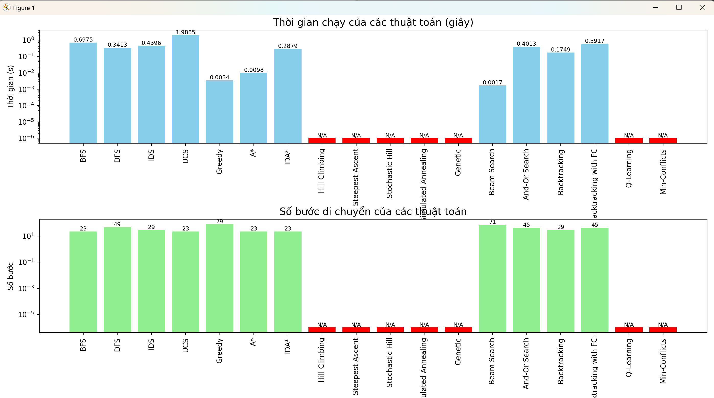

# Báo Cáo : Ứng Dụng Thuật Toán Tìm Kiếm trong Giải 8-Puzzle
## **Phần 1. Mở Đầu**
### 1.1. Lời Nói Đầu
Sự phát triển vượt bậc của công nghệ thông tin đã đưa trí tuệ nhân tạo (AI) trở thành công cụ then chốt trong việc giải quyết các bài toán phức tạp, từ điều hướng robot đến lập kế hoạch thông minh. Thuật toán tìm kiếm, một trụ cột của AI, cho phép hệ thống tự động đưa ra quyết định, tìm đường đi tối ưu, và giải các bài toán ràng buộc. 8-Puzzle, một trò chơi giải đố cổ điển với không gian trạng thái lớn (362.880 cấu hình, 1/2 khả thi), là mô hình lý tưởng để nghiên cứu và đánh giá các thuật toán tìm kiếm trong việc tìm đường đi tối ưu dưới các ràng buộc và môi trường đa dạng.

Đề tài **“Ứng dụng thuật toán tìm kiếm trong giải 8-Puzzle”** tập trung nghiên cứu, triển khai, và đánh giá hiệu quả của sáu nhóm thuật toán tìm kiếm, từ đó áp dụng vào các bài toán thực tế như lập kế hoạch di chuyển robot trong không gian hạn chế. Báo cáo này trình bày quá trình phát triển hệ thống, kết quả thực nghiệm, phân tích hiệu suất, và định hướng phát triển trong tương lai.

**Kết quả cần đạt:**

Hệ thống ứng dụng: Chương trình tự động giải 8-Puzzle từ trạng thái nhập vào, sử dụng sáu nhóm thuật toán, hiển thị chi tiết các bước di chuyển, và cung cấp thông tin so sánh về thời gian chạy, số bước di chuyển, và bộ nhớ sử dụng.

Công nghệ ứng dụng: Áp dụng thuật toán tìm kiếm vào bài toán thực tế với không gian trạng thái lớn và nhiều ràng buộc logic, sử dụng Python 3.12 và Tkinter để xây dựng giao diện trực quan hóa dữ liệu.

### 1.2. Mục Tiêu
Đề tài nhằm nghiên cứu, triển khai, và đánh giá hiệu quả của các thuật toán tìm kiếm trong bài toán 8-Puzzle, với các mục tiêu cụ thể:

Phân tích đặc điểm của 8-Puzzle: không gian trạng thái, số đảo ngược, khoảng cách Manhattan, ràng buộc di chuyển, và các môi trường (bao gồm Partially Observable và Sensorless).

Nghiên cứu và triển khai sáu nhóm thuật toán tìm kiếm:

Tìm kiếm có thông tin: A*, Greedy Best-First Search, IDA*.

Tìm kiếm không thông tin: Breadth-First Search (BFS), Depth-First Search (DFS), Iterative Deepening Search (IDS), Uniform Cost Search (UCS).

Tìm kiếm ràng buộc: Backtracking, Backtracking with Forward Checking (FC), Min-Conflicts.

Tìm kiếm học tăng cường: Q-Learning.

Tìm kiếm cục bộ: Hill Climbing, Steepest Ascent Hill Climbing, Stochastic Hill Climbing, Beam Search, Genetic Algorithm, Simulated Annealing.

Tìm kiếm trong môi trường phức tạp: Partially Observable Search, Sensorless Search, And-Or Search.

So sánh hiệu suất các thuật toán dựa trên thời gian tìm kiếm, số bước di chuyển, khả năng tìm giải pháp tối ưu, và mức tiêu thụ tài nguyên (bộ nhớ, CPU).

### 1.3. Phạm Vi và Đối Tượng

**Phạm vi:**

Đề tài được thực hiện trong một học kỳ, bao gồm các giai đoạn: tìm hiểu bài toán, nghiên cứu thuật toán, thiết kế hệ thống, lập trình mô phỏng, thu thập kết quả, và viết báo cáo.

Tập trung vào 8-Puzzle 2D với trạng thái ban đầu do người dùng nhập hoặc sinh ngẫu nhiên, thuộc lĩnh vực AI, cụ thể là tìm kiếm trong không gian trạng thái. Các trạng thái thử nghiệm có độ phức tạp tăng dần (dựa trên số đảo ngược và khoảng cách Manhattan).

Sử dụng Python 3.12 và Tkinter để xây dựng giao diện trực quan, cho phép quan sát quá trình tìm kiếm và mô phỏng các bước di chuyển, đặc biệt trong các môi trường phức tạp như Partially Observable và Sensorless.

**Đối tượng:**

Sáu nhóm thuật toán tìm kiếm được chọn do sự đa dạng về chiến lược, ưu/nhược điểm, và khả năng áp dụng cho 8-Puzzle – một bài toán tìm đường với không gian trạng thái lớn và nhiều ràng buộc di chuyển.

Đối tượng sử dụng: Sinh viên học môn Trí tuệ nhân tạo, lập trình viên quan tâm đến trò chơi giải đố, và các nhà nghiên cứu AI muốn phân tích hiệu quả thuật toán tìm kiếm.

Đề tài nhấn mạnh trực quan hóa quá trình tìm kiếm, đặc biệt trong các môi trường phức tạp, để minh họa, phân tích, và so sánh hiệu quả thuật toán.

### 1.4. Phương Pháp Nghiên Cứu
**Thu thập thông tin:** Nghiên cứu tài liệu về AI, thuật toán tìm kiếm, và mô hình hóa 8-Puzzle dưới dạng không gian trạng thái. Khảo sát các chương trình mã nguồn mở liên quan để định hướng triển khai.

**Xử lý thông tin:**

Phân tích định tính: So sánh đặc điểm lý thuyết, chiến lược, ưu/nhược điểm, và yêu cầu tài nguyên của các thuật toán.

Phân tích định lượng: Đánh giá hiệu quả qua dữ liệu thực nghiệm (thời gian, số bước, bộ nhớ).

**Thực nghiệm:** Mô phỏng 8-Puzzle bằng Python và Tkinter, cho phép chọn thuật toán, nhập trạng thái, và giải tự động. Thực nghiệm trên các trạng thái với độ phức tạp tăng dần để đánh giá hiệu suất và khả năng áp dụng

## Danh sách hình vẽ
**Hình 1:** Giao diện trò chơi 8-Puzzle


**Hình 2:** Giao diện màn hình giải 8-Puzzle


**Hình 3:** Giao diện màn hình kết thúc


---

## **Phần 2. Cơ sở Lý Thuyết**
### 2.1. Tổng Quan về Trí Tuệ Nhân Tạo

Trí tuệ nhân tạo (AI) là lĩnh vực khoa học máy tính nghiên cứu xây dựng các hệ thống thực hiện nhiệm vụ đòi hỏi trí thông minh con người, bao gồm học hỏi, suy luận, nhận thức, giải quyết vấn đề, và ra quyết định. Các nhánh chính của AI:

Tìm kiếm và giải quyết vấn đề: Phát triển thuật toán tìm giải pháp tối ưu trong không gian trạng thái phức tạp.

Biểu diễn tri thức: Lưu trữ và xử lý thông tin để hỗ trợ suy luận

Học máy: Xây dựng mô hình tự cải thiện qua dữ liệu.

Quy hoạch và ra quyết định: Lập kế hoạch hành động dài hạn để đạt mục tiêu.

### 2.2. Tổng Quan về 8-Puzzle

8-Puzzle là trò chơi giải đố trên lưới 3x3, gồm 8 ô số (1-8) và 1 ô trống (0). Người chơi di chuyển ô trống lên, xuống, trái, hoặc phải để sắp xếp các ô số về trạng thái mục tiêu (thường là [[1, 2, 3], [4, 5, 6], [7, 8, 0]]).

Độ phức tạp: Không gian trạng thái có 9! = 362.880 cấu hình, nhưng chỉ một nửa là khả thi (dựa trên tính chẵn của số đảo ngược).

Ràng buộc: Ô trống chỉ di chuyển đến các ô liền kề trong lưới.

Đặc điểm: Thuộc lớp bài toán NP-Hard, độ khó tăng khi mở rộng sang các môi trường phức tạp như Partially Observable (thông tin không đầy đủ) hoặc Sensorless (không quan sát được trạng thái).

### 2.3. Cấu Trúc Bài Toán Tìm Kiếm

Bài toán tìm kiếm trong AI bao gồm:

Không gian trạng thái: Tập hợp các trạng thái, biểu diễn dưới dạng đồ thị (đỉnh là trạng thái, cạnh là hành động).

Trạng thái ban đầu: Điểm xuất phát của bài toán.

Phép chuyển trạng thái: Các hành động khả thi  chuyển từ trạng thái này sang trạng thái khác.

Mô hình chuyển đổi: Kết quả của hành động .

Kiểm tra mục tiêu: Xác định trạng thái mục tiêu .

Chi phí đường đi: Tổng chi phí các hành động (g(n)).

### 2.4. Bài Toán 8-Puzzle Dưới Góc Nhìn Thuật Toán

8-Puzzle là bài toán tìm kiếm trong không gian trạng thái có ràng buộc, yêu cầu lập kế hoạch chuỗi hành động hợp lệ từ trạng thái ban đầu đến mục tiêu.

Trạng thái: Ma trận 3x3 (list[list[int]]), ví dụ: [[2, 8, 3], [1, 6, 4], [7, 0, 5]].

Ràng buộc: Ô trống chỉ di chuyển đến ô liền kề (lên, xuống, trái, phải).

Môi trường phức tạp:

Partially Observable: Chỉ biết một phần thông tin (ví dụ: vị trí ô trống nhưng không biết vị trí các ô số), yêu cầu quản lý tập niềm tin.

Sensorless: Không biết trạng thái hiện tại, cần đồng bộ tập niềm tin về trạng thái mục tiêu.

And-Or Search: Xử lý các trạng thái hoặc hành động không xác định, mô phỏng môi trường ngẫu nhiên.

### 2.5. Các Thuật Toán Tìm Kiếm

**2.5.1. Tìm Kiếm Có Thông Tin (Informed Search)**
Thuật toán tìm kiếm có thông tin sử dụng hàm heuristic để ước lượng chi phí từ trạng thái hiện tại đến mục tiêu, giúp ưu tiên các trạng thái tiềm năng và giảm số node cần khám phá.

A*: Sử dụng hàm đánh giá f(n) = g(n) + h(n), trong đó g(n) là chi phí từ trạng thái ban đầu đến trạng thái hiện tại, và h(n) là heuristic ước lượng chi phí đến mục tiêu. Với 8-Puzzle, heuristic khoảng cách Manhattan (tổng khoảng cách mỗi ô cần di chuyển đến vị trí đích) là admissible (không ước lượng quá) và consistent (tuân theo bất đẳng thức tam giác), đảm bảo giải pháp tối ưu. Ví dụ: Với trạng thái [[2, 8, 3], [1, 6, 4], [7, 0, 5]], A* ưu tiên các nước đi giảm tổng khoảng cách Manhattan (ví dụ: di chuyển ô trống sang trái để đưa ô 6 gần vị trí đích). Ưu điểm: Tìm đường đi ngắn nhất. Nhược điểm: Tốn bộ nhớ do sử dụng hàng đợi ưu tiên.

Greedy Best-First Search: Chỉ sử dụng h(n), chọn trạng thái có giá trị heuristic thấp nhất mà không quan tâm đến g(n). Thuật toán này nhanh nhưng dễ bỏ qua giải pháp tối ưu. Ví dụ: Nếu di chuyển ô trống làm giảm khoảng cách Manhattan của ô 8 nhưng tăng tổng chi phí, Greedy vẫn ưu tiên nước đi đó. Ưu điểm: Tốc độ cao. Nhược điểm: Không đảm bảo tối ưu.

Iterative Deepening A (IDA)**: Kết hợp A* với tìm kiếm chiều sâu, sử dụng ngưỡng f(n) và tăng dần qua các vòng lặp. IDA* tiết kiệm bộ nhớ hơn A* vì không lưu toàn bộ hàng đợi ưu tiên, rất phù hợp cho 8-Puzzle với không gian trạng thái lớn. Ví dụ: IDA* bắt đầu với ngưỡng f(n) dựa trên trạng thái ban đầu và chỉ khám phá các node có f(n) dưới ngưỡng, tăng ngưỡng nếu không tìm thấy mục tiêu. Ưu điểm: Tối ưu và tiết kiệm bộ nhớ. Nhược điểm: Có thể lặp lại nhiều trạng thái.

**So sánh:**

A* hiệu quả nhất về chất lượng giải pháp, nhưng tốn bộ nhớ hơn IDA*.

Greedy nhanh nhất nhưng thường tạo ra đường đi dài hơn.

IDA* cân bằng giữa chất lượng và bộ nhớ, phù hợp cho các hệ thống tài nguyên hạn chế.

**2.5.2. Tìm Kiếm Không Thông Tin (Uninformed Search)**

Thuật toán tìm kiếm không thông tin không sử dụng heuristic, dựa vào việc duyệt hệ thống qua cấu trúc cố định, phù hợp khi không có thông tin về khoảng cách đến mục tiêu.

Breadth-First Search (BFS): Duyệt theo chiều rộng, khám phá tất cả trạng thái ở cùng độ sâuVì dụ: Với trạng thái ban đầu [[1, 2, 3], [4, 0, 5], [7, 8, 6]], BFS duyệt tất cả các nước đi khả thi (lên, xuống, trái, phải) ở mỗi bước trước khi chuyển sang độ sâu tiếp theo. BFS đảm bảo tìm đường đi ngắn nhất trong 8-Puzzle nhưng tốn bộ nhớ lớn do lưu trữ nhiều node. Ưu điểm: Đảm bảo giải pháp ngắn nhất. Nhược điểm: Tốn bộ nhớ.

Depth-First Search (DFS): Duyệt theo chiều sâu, theo một nhánh đến khi gặp ngõ cụt rồi quay lui. DFS tiết kiệm bộ nhớ nhưng có thể đi vào nhánh sâu vô hạn và không đảm bảo giải pháp tối ưu. Ví dụ: DFS có thể di chuyển ô trống theo một hướng (như lên) đến khi không thể tiếp tục, rồi quay lui. Ưu điểm: Tiết kiệm bộ nhớ. Nhược điểm: Không tối ưu, dễ kẹt.

Iterative Deepening Search (IDS): Kết hợp DFS với giới hạn độ sâu tăng dần, lặp lại DFS với độ sâu tối đa tăng từ 1 đến khi tìm thấy mục tiêu. IDS đảm bảo giải pháp ngắn nhất như BFS nhưng tiết kiệm bộ nhớ hơn. Ưu điểm: Tối ưu và tiết kiệm bộ nhớ. Nhược điểm: Lặp lại nhiều trạng thái.

Uniform Cost Search (UCS): Tương tự BFS nhưng ưu tiên trạng thái có chi phí đường đi (g(n)) thấp nhất. Trong 8-Puzzle, nếu mỗi nước đi có chi phí bằng nhau, UCS hoạt động giống BFS nhưng linh hoạt hơn nếu chi phí khác nhau (ví dụ: di chuyển ngang dọc có trọng số khác). Ưu điểm: Tối ưu về chi phí. Nhược điểm: Tốn bộ nhớ.

**So sánh:**

BFS và UCS đảm bảo giải pháp ngắn nhất nhưng tốn bộ nhớ, phù hợp khi bộ nhớ không bị hạn chế.

DFS tiết kiệm bộ nhớ nhưng không tối ưu, dễ bị kẹt ở nhánh sâu.

IDS là sự thỏa hiệp, đạt giải pháp tối ưu như BFS nhưng sử dụng ít bộ nhớ hơn, dù chậm hơn do lặp lại.

**2.5.3. Tìm Kiếm Ràng Buộc (Constraint-Based Search)**

Thuật toán tìm kiếm ràng buộc tập trung vào việc thỏa mãn các ràng buộc của bài toán, sử dụng kỹ thuật quay lui hoặc kiểm tra trước để giảm không gian tìm kiếm.

Backtracking: Thử tất cả các nước đi khả thi, quay lui khi gặp trạng thái không thỏa mãn. Trong 8-Puzzle, Backtracking duyệt từng di chuyển của ô trống (lên, xuống, trái, phải) và quay lại nếu gặp ngõ cụt. Ví dụ: Nếu di chuyển ô trống dẫn đến trạng thái đã thăm, Backtracking quay lui để thử nước đi khác. Ưu điểm: Đơn giản, dễ triển khai. Nhược điểm: Chậm do duyệt nhiều nhánh không cần thiết.

Backtracking with Forward Checking (FC): Bổ sung kiểm tra trước các ràng buộc để loại bỏ sớm các nhánh không khả thi. Ví dụ: Nếu một nước đi dẫn đến trạng thái có số đảo ngược không phù hợp (lẻ), FC loại bỏ nhánh đó ngay lập tức. Ưu điểm: Hiệu quả hơn Backtracking cơ bản. Nhược điểm: Vẫn chậm với trạng thái phức tạp.

Min-Conflicts: Một thuật toán cục bộ, chọn ngẫu nhiên một ô có xung đột (ô không ở vị trí đích) và di chuyển để giảm xung đột. Trong 8-Puzzle, Min-Conflicts được điều chỉnh để chỉ di chuyển ô trống đến các ô liền kề, tuân thủ luật chơi. Ví dụ: Nếu ô 8 sai vị trí, Min-Conflicts thử di chuyển ô trống để đưa ô 8 gần vị trí đích hơn. Ưu điểm: Nhanh cho trạng thái gần mục tiêu. Nhược điểm: Không đảm bảo giải pháp tối ưu.

**So sánh:**

Backtracking with FC hiệu quả hơn Backtracking nhờ loại bỏ sớm các nhánh không khả thi, nhưng vẫn chậm hơn các thuật toán heuristic.

Min-Conflicts nhanh nhưng không đảm bảo tối ưu, phù hợp cho các trạng thái gần mục tiêu hoặc khi tốc độ là ưu tiên.

Backtracking đơn giản nhất nhưng kém hiệu quả nhất về thời gian.

**2.5.4. Tìm Kiếm Học Tăng Cường (Reinforcement Search)**

Thuật toán học tăng cường học cách chọn hành động tối ưu thông qua thử và sai, dựa trên phần thưởng từ môi trường.

Q-Learning: Học bảng giá trị Q để ánh xạ trạng thái-hành động với phần thưởng dài hạn. Trong 8-Puzzle, Q-Learning học các chiến lược di chuyển ô trống để đạt trạng thái mục tiêu, với phần thưởng cao khi đạt đích. Ví dụ: Nếu di chuyển ô trống sang phải làm giảm khoảng cách Manhattan, Q-Learning tăng giá trị Q cho hành động đó. Ưu điểm: Linh hoạt, học được chiến lược dài hạn. Nhược điểm: Cần thời gian huấn luyện dài.

**So sánh:**

Q-Learning là thuật toán duy nhất trong nhóm, phù hợp cho các bài toán lặp lại hoặc có yếu tố ngẫu nhiên, nhưng hiệu quả phụ thuộc vào thời gian huấn luyện và kích thước không gian trạng thái.

**2.5.5. Tìm Kiếm Cục Bộ (Local Search)**

Thuật toán tìm kiếm cục bộ tập trung vào cải thiện trạng thái hiện tại qua các bước nhỏ, không duy trì toàn bộ không gian trạng thái, phù hợp khi cần giải pháp nhanh hoặc không gian trạng thái quá lớn.

Hill Climbing: Chọn nước đi cải thiện trạng thái hiện tại (giảm h(n), ví dụ: giảm khoảng cách Manhattan). Ví dụ: Với trạng thái [[1, 2, 3], [4, 0, 5], [7, 8, 6]], Hill Climbing chọn di chuyển ô trống làm giảm tổng khoảng cách Manhattan nhất. Ưu điểm: Nhanh, đơn giản. Nhược điểm: Dễ kẹt ở cực đại cục bộ.

Steepest Ascent Hill Climbing: Luôn chọn nước đi có cải thiện lớn nhất (giảm h(n) nhiều nhất) trong tất cả các nước đi khả thi. Ví dụ: Nếu di chuyển ô trống sang phải giảm 2 đơn vị Manhattan, trong khi sang trái chỉ giảm 1, Steepest Ascent chọn di chuyển sang phải. Ưu điểm: Hiệu quả hơn Hill Climbing cơ bản. Nhược điểm: Vẫn có thể kẹt ở cực đại cục bộ.

Stochastic Hill Climbing: Chọn ngẫu nhiên một nước đi trong số các nước đi cải thiện trạng thái, thay vì luôn chọn nước đi tốt nhất. Điều này giúp thoát khỏi một số cực đại cục bộ. Ví dụ: Nếu có hai nước đi đều giảm h(n), Stochastic Hill Climbing chọn ngẫu nhiên để đa dạng hóa tìm kiếm. Ưu điểm: Giảm nguy cơ kẹt cục bộ. Nhược điểm: Không đảm bảo tối ưu.

Beam Search: Giữ một số trạng thái tốt nhất (beam width) ở mỗi bước, giảm không gian tìm kiếm so với BFS. Ví dụ: Với beam width = 50, chỉ 50 trạng thái có h(n) thấp nhất được giữ lại ở mỗi bước. Ưu điểm: Cân bằng giữa tốc độ và chất lượng. Nhược điểm: Phụ thuộc vào tham số beam width.

Genetic Algorithm: Mô phỏng tiến hóa tự nhiên, sử dụng quần thể trạng thái, lai ghép (kết hợp hai trạng thái) và đột biến (thay đổi ngẫu nhiên) để tìm giải pháp. Trong 8-Puzzle, mỗi trạng thái là một "cá thể", và hàm fitness dựa trên khoảng cách Manhattan. Ví dụ: Lai ghép hai trạng thái có thể tạo ra một trạng thái mới với số đảo ngược thấp hơn. Ưu điểm: Phù hợp cho không gian trạng thái lớn. Nhược điểm: Cần điều chỉnh tham số (tỷ lệ lai ghép, đột biến).

Simulated Annealing: Chấp nhận các trạng thái xấu hơn với xác suất giảm dần (dựa trên "nhiệt độ"), giúp thoát khỏi cực đại cục bộ. Ví dụ: Nếu một nước đi làm tăng h(n), Simulated Annealing vẫn có thể chấp nhận ở giai đoạn đầu để khám phá thêm. Ưu điểm: Thoát cực đại cục bộ tốt. Nhược điểm: Cần điều chỉnh tham số nhiệt độ.

**So sánh:**

Steepest Ascent hiệu quả hơn Hill Climbing nhờ chọn nước đi tối ưu cục bộ, nhưng cả hai dễ kẹt ở cực đại cục bộ.

Stochastic Hill Climbing cải thiện khả năng thoát cực đại cục bộ so với Steepest Ascent, nhưng kém ổn định.

Beam Search cân bằng giữa tốc độ và chất lượng, nhưng phụ thuộc vào beam width.

Genetic Algorithm khám phá không gian trạng thái rộng hơn, nhưng chậm và phức tạp hơn.

Simulated Annealing vượt trội trong việc thoát cực đại cục bộ, nhưng cần điều chỉnh tham số cẩn thận.

**2.5.6. Tìm Kiếm trong Môi Trường Phức Tạp (Complex Environment Search)**

Thuật toán này được thiết kế cho các môi trường không hoàn toàn quan sát được hoặc thiếu thông tin trạng thái, như trong các ứng dụng thực tế với dữ liệu không đầy đủ.

Partially Observable Search: Xử lý các trạng thái chỉ quan sát được một phần, quản lý tập niềm tin (belief states) để xác định hành động. Trong 8-Puzzle, thuật toán này mô phỏng tình huống thiếu thông tin về vị trí các ô, ví dụ: chỉ biết vị trí ô trống mà không biết vị trí các ô số. Tập niềm tin được cập nhật sau mỗi hành động để thu hẹp phạm vi trạng thái khả thi. Ví dụ: Nếu ô trống di chuyển sang phải, tập niềm tin được cập nhật để chỉ bao gồm các trạng thái có ô trống ở vị trí mới. Ưu điểm: Xử lý tốt môi trường không chắc chắn. Nhược điểm: Phức tạp, tốn tài nguyên để quản lý tập niềm tin.

Sensorless Search: Không có thông tin quan sát, yêu cầu đồng bộ tập niềm tin để đạt trạng thái mục tiêu. Trong 8-Puzzle, Sensorless Search giả định không biết trạng thái ban đầu và phải tìm chuỗi hành động đưa mọi trạng thái khả thi về đích. Ví dụ: Chuỗi di chuyển ô trống có thể được thiết kế để đảm bảo tất cả trạng thái trong tập niềm tin đạt [[1, 2, 3], [4, 5, 6], [7, 8, 0]]. Ưu điểm: Phù hợp cho môi trường hoàn toàn không quan sát được. Nhược điểm: Cực kỳ chậm do phải xử lý toàn bộ tập niềm tin.

And-Or Search: Kết hợp tìm kiếm AND (khám phá nhiều hành động từ một trạng thái) và OR (chọn nhánh tốt nhất) để xử lý các trạng thái không xác định. Trong 8-Puzzle, And-Or Search hữu ích khi có nhiều mục tiêu hoặc khi môi trường có yếu tố ngẫu nhiên, như các ô số có thể thay đổi vị trí không dự đoán được. Ví dụ: Nếu di chuyển ô trống có thể dẫn đến nhiều trạng thái khác nhau do yếu tố ngẫu nhiên, And-Or Search xây dựng cây tìm kiếm để khám phá tất cả khả năng. Ưu điểm: Linh hoạt trong môi trường phức tạp. Nhược điểm: Phức tạp trong triển khai và tính toán.

**So sánh:**

Partially Observable Search phù hợp khi có một phần thông tin, nhưng tốn tài nguyên hơn And-Or Search do quản lý tập niềm tin.

Sensorless Search là lựa chọn cuối cùng khi không có thông tin quan sát, nhưng rất chậm và không thực tế cho các trạng thái phức tạp.

And-Or Search linh hoạt nhất, phù hợp cho các môi trường có yếu tố ngẫu nhiên hoặc nhiều mục tiêu.

**2.6. Công Cụ và Kỹ Thuật**

Ngôn ngữ lập trình: Python 3.12, hỗ trợ đa nền tảng, dễ tích hợp thư viện.

Thư viện:

Tkinter: Tạo giao diện đồ họa, xử lý sự kiện người dùng.

Collections: Hỗ trợ hàng đợi (queue) và heap cho các thuật toán tìm kiếm.

Numpy: Hỗ trợ tính toán ma trận và xử lý dữ liệu số.

Môi trường phát triển: Visual Studio Code, hệ điều hành Windows 11.

Kỹ thuật tối ưu: Sử dụng Forward Checking để giảm nhánh không cần thiết, heuristic như khoảng cách Manhattan để tăng hiệu quả tìm kiếm, và quản lý tập niềm tin cho các môi trường phức tạp.

## **Phần 3. Phân Tích và Thiết Kế Giải Pháp**

### 3.1. Phân Tích Hệ Thống

**3.1.1. Phân Tích Yêu Cầu**

Nhập liệu: Người dùng nhập trạng thái ban đầu hoặc hệ thống sinh ngẫu nhiên, kiểm tra tính khả thi (số đảo ngược chẵn).

Xử lý: Triển khai sáu nhóm thuật toán tìm kiếm để giải bài toán.

Đầu ra: Hiển thị các bước di chuyển qua giao diện trực quan, hỗ trợ mô phỏng từng bước, và cung cấp thông tin thống kê (thời gian, số bước, bộ nhớ).

Đánh giá: So sánh hiệu suất thuật toán qua các tiêu chí: thời gian chạy, số bước di chuyển, số node mở rộng, và bộ nhớ sử dụng.

**3.1.2. Xác Định Thực Thể Chính**

Ô số (1-8): Các ô cần sắp xếp về vị trí mục tiêu.

Ô trống (0): Ô có thể di chuyển lên, xuống, trái, hoặc phải.

Trạng thái: Ma trận 3x3 biểu diễn vị trí các ô.

Tập niềm tin: Trong môi trường phức tạp (Partially Observable, Sensorless), tập hợp các trạng thái khả thi dựa trên thông tin quan sát được.

**3.1.3. Phân Tích Hành Động và Quy Tắc**

Hành động: Di chuyển ô trống: lên (U), xuống (D), trái (L), phải (R).

Quy tắc: Ô trống chỉ di chuyển nếu ô đích nằm trong lưới 3x3.

Điều kiện hoàn thành: Trạng thái đạt mục tiêu (ví dụ: [[1, 2, 3], [4, 5, 6], [7, 8, 0]]).

Môi trường phức tạp: Quản lý tập niềm tin, kiểm tra mục tiêu dựa trên tập hợp trạng thái khả thi (Partially Observable, Sensorless) hoặc xử lý các nhánh không xác định (And-Or Search).

### 3.2. Mô Hình Hóa Trạng Thái, Hành Động, và Tính Hợp Lệ

Trạng thái: Ma trận 3x3 (list[list[int]]). Vị trí ô trống được lưu dưới dạng tuple (x, y) để truy xuất nhanh.

Hành động: Lên, Xuống, Trái Phải.

Kiểm tra hợp lệ .

Tính khả thi (is_solvable): Trạng thái khả thi nếu số đảo ngược (inversions) là chẵn.

### 3.3. Áp Dụng Thuật Toán Tìm Kiếm

Sáu nhóm thuật toán được triển khai như mô tả ở Phần 2.5, với các cấu trúc dữ liệu phù hợp:

Tìm kiếm có thông tin: Sử dụng hàng đợi ưu tiên (heapq) cho A* và Greedy, danh sách node cho IDA*.

Tìm kiếm không thông tin: Sử dụng hàng đợi FIFO (deque) cho BFS, ngăn xếp (stack) cho DFS, hàng đợi ưu tiên cho UCS, và danh sách node cho IDS.

Tìm kiếm ràng buộc: Sử dụng đệ quy cho Backtracking và FC, danh sách trạng thái cho Min-Conflicts.

Tìm kiếm học tăng cường: Sử dụng bảng Q (dictionary) cho Q-Learning.

Tìm kiếm cục bộ: Sử dụng danh sách trạng thái cho Hill Climbing, Steepest Ascent, Stochastic Hill Climbing, Beam Search, và Simulated Annealing; danh sách quần thể cho Genetic Algorithm.

Tìm kiếm trong môi trường phức tạp: Sử dụng tập hợp trạng thái (set) cho tập niềm tin trong Partially Observable và Sensorless, cây tìm kiếm cho And-Or Search.

Đầu ra: Danh sách trạng thái từ ban đầu đến mục tiêu, thống kê (thời gian thực thi, số bước di chuyển).

### 3.4. Sơ Đồ Hoạt Động Hệ Thống

Sơ đồ khối hệ thống 8-Puzzle





Input: Trạng thái ban đầu từ người dùng hoặc sinh ngẫu nhiên, nhập qua giao diện (gui).

Xử lý:

Chương trình chính: main.py điều khiển luồng thực thi, gọi các thuật toán từ các thư mục tương ứng và hiển thị kết quả.

Thuật toán cơ bản: PY_base_solver.py cung cấp lớp cơ sở cho các thuật toán, được sử dụng bởi các thư mục con.

Tìm kiếm không thông tin: uninformed_search chứa các thuật toán như BFS, DFS, IDS, UCS.

Tìm kiếm có thông tin: informed_search chứa A*, Greedy, IDA*.

Tìm kiếm cục bộ: local_search chứa Hill Climbing, Steepest Ascent, Stochastic Hill Climbing, Beam Search, Genetic Algorithm, Simulated Annealing.

Tìm kiếm học tăng cường: reinforcement_learning chứa Q-Learning, lưu bảng Q trong q_table.pkl.

Tìm kiếm ràng buộc: CSPs chứa Backtracking, Backtracking with FC, Min-Conflicts.

Tìm kiếm trong môi trường phức tạp: complex_environments chứa Partially Observable Search, Sensorless Search, And-Or Search.

Hỗ trợ: utils chứa các hàm phụ trợ (kiểm tra tính hợp lệ, tính khoảng cách Manhattan, quản lý tập niềm tin)

Output: Hiển thị giao diện qua gui, lưu kết quả (danh sách bước, thống kê), với animation từ Video.gif và tập các hình ảnh cho bài báo cáo từ images. Thông tin dự án được ghi trong README.md, phụ thuộc vào requirements.txt.

Quản lý: .gitignore cấu hình tệp bị bỏ qua trong Git.

## Demo Chương trình

### Uninformed Search

**Demo thuật toán BFS**


**Demo thuật toán DFS**


**Demo thuật toán IDS**


**Demo thuật toán UCS**


### Informed Search

 **Demo thuật toán A Star**


**Demo thuật toán Greedy**


**Demo thuật toán IDA_Star**


###  Local Search

**Demo thuật toán Hill_Simple_Climbing**


**Demo thuật toán Steepest_Ascent**


**Demo thuật toán Stochastic_Hill**


**Demo thuật toán Simulated_Annealing**


**Demo thuật toán Genetic**


**Demo thuật toán Beam_Search**


### CSPs

**Demo thuật toán Backtracking**


**Demo thuật toán Backtracking with Foward Checking**


**Demo thuật toán Min Conflicts**


### Complex Environments

**Demo thuật toán And-Or Search**


**Demo Partially Observable**


**Demo thuật toán Sensorless**


### Reinforcement Learning

**Demo thuật toán Q Learning**


---


## Phần 4. Thực Nghiệm, Đánh Giá, và Phân Tích Kết Quả

### 4.1. Kết Quả Thực Nghiệm

| Thuật Toán                        | Thời Gian Chạy (s) | Số Bước Di Chuyển | Kết Quả     | Ước Lượng Bộ Nhớ (MB) |
|----------------------------------|---------------------|--------------------|-------------|------------------------|
| BFS                              | 0.69745             | 23                 | Thành công  | 100 - 200              |
| DFS                              | 0.34128             | 49                 | Thành công  | 5 - 15                 |
| IDS                              | 0.43958             | 29                 | Thành công  | 10 - 20                |
| UCS                              | 1.98850             | 23                 | Thành công  | 100 - 200              |
| Greedy Best-First Search         | 0.00345             | 79                 | Thành công  | 30 - 80                |
| A*                               | 0.00981             | 23                 | Thành công  | 50 - 100               |
| IDA*                             | 0.28786             | 23                 | Thành công  | 10 - 20                |
| Hill Climbing                    | -                   | -                  | Thất bại    | 5 - 10                 |
| Steepest Ascent Hill Climbing   | -                   | -                  | Thất bại    | 5 - 10                 |
| Stochastic Hill Climbing        | -                   | -                  | Thất bại    | 5 - 10                 |
| Simulated Annealing             | -                   | -                  | Thất bại    | 10 - 30                |
| Genetic Algorithm               | -                   | -                  | Thất bại    | 30 - 70                |
| Beam Search                     | 0.00169             | 71                 | Thành công  | 20 - 50                |
| And-Or Search                   | 0.40126             | 45                 | Thành công  | 50 - 150               |
| Backtracking                    | 0.17491             | 29                 | Thành công  | 10 - 30                |
| Backtracking with FC            | 0.59167             | 45                 | Thành công  | 15 - 35                |
| Q-Learning                      | -                   | -                  | Thất bại    | 20 - 50                |
| Min-Conflicts                   | -                   | -                  | Thất bại    | 5 - 10                 |

---

### Trực quan hóa



---

**Phân tích và đánh giá:**

**Hiệu quả thời gian**

Beam Search (0.00169s) và Greedy Best-First Search (0.00345s) nhanh nhất, nhưng tạo ra đường đi không tối ưu (71 và 79 bước). Điều này phù hợp với lý thuyết rằng các thuật toán ưu tiên heuristic hoặc giới hạn không gian tìm kiếm (beam width) thường nhanh nhưng kém tối ưu

A (0.00981s)* đạt thời gian rất tốt và đường đi tối ưu (23 bước), chứng minh hiệu quả của heuristic khoảng cách Manhattan trong việc giảm không gian tìm kiếm.

UCS (1.9885s) chậm nhất trong các thuật toán thành công, do duyệt nhiều node hơn để đảm bảo chi phí tối ưu, tương tự BFS (0.69745s).

Backtracking with FC (0.59167s) chậm hơn Backtracking (0.17491s), có thể do chi phí kiểm tra trước các ràng buộc vượt quá lợi ích trong trạng thái thử nghiệm này.

And-Or Search (0.40126s) và IDS (0.43958s) có thời gian trung bình, phản ánh sự phức tạp của các chiến lược không heuristic.

**Chất lượng giải pháp (số bước di chuyển):**

A, BFS, UCS, và IDA** tìm được đường đi tối ưu (23 bước), phù hợp với lý thuyết rằng các thuật toán này đảm bảo giải pháp ngắn nhất trong không gian trạng thái không trọng số.

Greedy (79 bước) và Beam Search (71 bước) tạo ra đường đi dài hơn đáng kể, do ưu tiên heuristic (Greedy) hoặc giới hạn số trạng thái được giữ lại (Beam Search).

DFS (49 bước), And-Or Search (45 bước), và Backtracking with FC (45 bước) tạo ra đường đi không tối ưu, phản ánh nhược điểm của các chiến lược không đảm bảo tính tối ưu.

IDS (29 bước) gần tối ưu, cho thấy hiệu quả của việc kết hợp DFS với giới hạn độ sâu tăng dần.

Backtracking (29 bước) bất ngờ đạt số bước tốt, nhưng điều này có thể phụ thuộc vào trạng thái cụ thể.

**Khả năng giải bài toán:**

Các thuật toán Hill Climbing, Steepest Ascent Hill Climbing, Stochastic Hill Climbing, Simulated Annealing, Genetic Algorithm, Q-Learning, và Min-Conflicts không giải được bài toán trong thử nghiệm này. Nguyên nhân có thể bao gồm:

Hill Climbing, Steepest Ascent, Stochastic Hill Climbing: Kẹt ở cực đại cục bộ do chỉ chọn nước đi cải thiện cục bộ, không thoát được các trạng thái không tối ưu. Ví dụ: Nếu trạng thái ban đầu có nhiều ô sai vị trí, các thuật toán này có thể dừng ở trạng thái không phải mục tiêu.

Simulated Annealing: Tham số nhiệt độ hoặc lịch trình làm nguội chưa được tối ưu, dẫn đến không khám phá đủ không gian trạng thái để thoát khỏi cực đại cục bộ.

Genetic Algorithm: Thiếu thời gian hội tụ hoặc tham số (kích thước quần thể, tỷ lệ đột biến) chưa phù hợp, khiến quần thể không tiến hóa đến trạng thái mục tiêu.

Q-Learning: Thời gian huấn luyện không đủ hoặc không gian trạng thái 8-Puzzle quá lớn để học được bảng Q hiệu quả trong thời gian giới hạn.

Min-Conflicts: Không phù hợp với 8-Puzzle khi các xung đột không được định nghĩa rõ ràng hoặc khi trạng thái ban đầu quá xa mục tiêu, dẫn đến không tìm được chuỗi di chuyển hợp lệ.

Các thuật toán thành công (A, BFS, UCS, IDA, Greedy, Beam Search, DFS, IDS, Backtracking, Backtracking with FC, And-Or Search**) cho thấy sự đa dạng trong cách tiếp cận, từ tìm kiếm toàn diện (BFS, UCS) đến tìm kiếm heuristic (A*, Greedy) và tìm kiếm trong môi trường phức tạp (And-Or Search).

**Bộ nhớ sử dụng:**

BFS và UCS sử dụng nhiều bộ nhớ nhất (100-200 MB) do lưu trữ toàn bộ hàng đợi các node, đặc biệt trong không gian trạng thái lớn của 8-Puzzle.

DFS, IDS, và IDA* tiết kiệm bộ nhớ (5-20 MB) do chỉ lưu trữ một nhánh hoặc giới hạn độ sâu, phù hợp cho các hệ thống tài nguyên hạn chế.

Greedy, Beam Search, Backtracking, và Backtracking with FC có mức sử dụng bộ nhớ trung bình (10-80 MB), cân bằng giữa hiệu quả và tài nguyên.

And-Or Search sử dụng bộ nhớ đáng kể (50-150 MB) do cần quản lý cây tìm kiếm phức tạp.

Các thuật toán thất bại (Hill Climbing, Steepest Ascent, Stochastic Hill Climbing, Min-Conflicts) sử dụng ít bộ nhớ (5-10 MB), nhưng điều này không có ý nghĩa khi không giải được bài toán.

**Kết luận:**

A* là thuật toán hiệu quả nhất, cân bằng giữa thời gian chạy nhanh (0.00981s), đường đi tối ưu (23 bước), và mức sử dụng bộ nhớ hợp lý (50-100 MB). Đây là lựa chọn tối ưu cho các ứng dụng cần cả tốc độ và chất lượng.

Greedy và Beam Search phù hợp cho các ứng dụng ưu tiên tốc độ, nhưng đường đi dài (79 và 71 bước) khiến chúng kém lý tưởng khi cần giải pháp tối ưu.

BFS, UCS, và IDA* lý tưởng khi cần giải pháp tối ưu, nhưng cần cải thiện quản lý bộ nhớ cho các trạng thái phức tạp hơn.

IDS và Backtracking đạt hiệu quả bất ngờ trong trạng thái thử nghiệm này, nhưng có thể không ổn định với các trạng thái khác.

And-Or Search hiệu quả trong môi trường phức tạp, nhưng thời gian và bộ nhớ cao hạn chế ứng dụng thực tế.

Các thuật toán cục bộ (Hill Climbing, Steepest Ascent, Stochastic Hill Climbing, Simulated Annealing, Genetic Algorithm), Q-Learning, và Min-Conflicts cần cải tiến đáng kể để áp dụng hiệu quả cho 8-Puzzle.

### 4.3. Link GitHub


```bash

https://github.com/QuocDat485/Bai_Bao_Cao_Ca_Nhan_23133015_NguyenQuocDat

```
---

## Phần 5. Kết Luận

### 5.1. Đánh Giá Kết Quả

Dự án đã đạt được các thành tựu sau:

Xây dựng chương trình tự động giải 8-Puzzle với sáu nhóm thuật toán (17 thuật toán cụ thể), trong đó A* nổi bật với thời gian chạy nhanh (0.00981s), đường đi tối ưu (23 bước), và sử dụng bộ nhớ hợp lý (50-100 MB).

Phát triển giao diện trực quan bằng Tkinter, hỗ trợ mô phỏng từng bước di chuyển, hiển thị tập niềm tin trong môi trường phức tạp (Partially Observable, Sensorless, And-Or Search), và cung cấp thống kê chi tiết.

Phân tích và so sánh hiệu suất thuật toán qua thực nghiệm, cung cấp cái nhìn sâu sắc về ưu/nhược điểm của từng chiến lược tìm kiếm, từ tìm kiếm toàn diện đến tìm kiếm trong môi trường không xác định.

**Hạn chế:**

Nhiều thuật toán cục bộ (Hill Climbing, Steepest Ascent Hill Climbing, Stochastic Hill Climbing, Simulated Annealing, Genetic Algorithm), Q-Learning, và Min-Conflicts không giải được bài toán, do kẹt ở cực đại cục bộ, tham số chưa tối ưu, hoặc không phù hợp với đặc điểm của 8-Puzzle.

BFS và UCS tiêu tốn bộ nhớ lớn (100-200 MB), không hiệu quả cho các trạng thái phức tạp hơn hoặc hệ thống tài nguyên hạn chế.

Greedy và Beam Search tạo ra đường đi dài (79 và 71 bước), không phù hợp khi cần giải pháp tối ưu.

And-Or Search, dù hiệu quả trong môi trường phức tạp, nhưng tốn thời gian (0.40126s) và bộ nhớ (50-150 MB), hạn chế ứng dụng thực tế.

Giao diện Tkinter chưa hỗ trợ luồng riêng (multithreading), có thể gây chậm khi xử lý các thuật toán tốn thời gian như UCS hoặc And-Or Search.

Thiếu thử nghiệm trên nhiều trạng thái với độ phức tạp khác nhau, khiến kết quả có thể không đại diện cho mọi trường hợp.

### 5.2. Định Hướng Phát Triển

Để khắc phục hạn chế và nâng cao hiệu quả, các hướng phát triển sau được đề xuất:

**Tối ưu thuật toán:**

Cải thiện heuristic cho A*, Greedy, và IDA* bằng cách kết hợp khoảng cách Manhattan với số đảo ngược hoặc sử dụng pattern database (lưu chi phí tối ưu cho các tập hợp ô con) để tăng độ chính xác của h(n).

Tối ưu tham số cho Beam Search (tăng beam width, ví dụ: 1000 hoặc 2000) và Simulated Annealing (điều chỉnh lịch trình nhiệt độ) để cải thiện khả năng tìm giải pháp.

Tăng thời gian huấn luyện và điều chỉnh tham số cho Q-Learning (learning rate, discount factor, exploration rate) để đảm bảo hội tụ trong không gian trạng thái lớn.

Thiết kế hàm xung đột phù hợp cho Min-Conflicts, ví dụ: dựa trên số ô sai vị trí hoặc khoảng cách Manhattan, để tăng khả năng tìm giải pháp.

Tối ưu Genetic Algorithm bằng cách tăng kích thước quần thể, điều chỉnh tỷ lệ lai ghép/đột biến, và sử dụng hàm fitness kết hợp nhiều yếu tố (khoảng cách Manhattan, số đảo ngược).

Cải thiện Hill Climbing, Steepest Ascent, Stochastic Hill Climbing bằng cách thêm cơ chế thoát cực đại cục bộ, như khởi động lại ngẫu nhiên (random restart) hoặc kết hợp với Simulated Annealing.

**Song song hóa:** Áp dụng xử lý song song (multiprocessing hoặc GPU) cho Genetic Algorithm, Beam Search, và Q-Learning để tăng tốc độ trên các trạng thái phức tạp hoặc lưới lớn hơn (15-Puzzle).

**Học sâu:** Tích hợp Deep Q-Learning hoặc mạng nơ-ron để học chiến lược giải 8-Puzzle hiệu quả hơn, đặc biệt trong các môi trường ngẫu nhiên hoặc không quan sát được (Partially Observable, Sensorless).

**Mở rộng bài toán:**

Áp dụng các thuật toán cho 15-Puzzle (lưới 4x4, 16! trạng thái) hoặc các biến thể động (ô trống di chuyển ngẫu nhiên, ô số thay đổi giá trị) để đánh giá khả năng mở rộng.

Thêm môi trường phức tạp hơn, như 8-Puzzle với nhiều mục tiêu hoặc ràng buộc bổ sung (ví dụ: ô số chỉ di chuyển theo hướng nhất định).

**Nâng cấp giao diện:**

Thêm multithreading để giao diện Tkinter mượt mà hơn, đặc biệt khi chạy các thuật toán chậm như UCS, And-Or Search, hoặc Sensorless Search.

Hỗ trợ trực quan hóa tập niềm tin bằng đồ họa động (biểu đồ cây, heatmap) để minh họa quá trình tìm kiếm trong môi trường phức tạp.

Thêm tính năng lưu và tải trạng thái thử nghiệm để dễ dàng tái sử dụng hoặc so sánh.

**Ứng dụng thực tế:**

Tích hợp các thuật toán vào hệ thống điều hướng robot (ví dụ: robot kho hàng), sử dụng 8-Puzzle như mô hình trừu tượng cho bài toán lập kế hoạch đường đi.

Áp dụng các thuật toán cho các bài toán tương tự, như tối ưu hóa lịch trình, quy hoạch mạng, hoặc trò chơi giải đố khác.

**Thử nghiệm mở rộng:** Thực hiện thử nghiệm trên nhiều trạng thái với độ phức tạp khác nhau (số đảo ngược từ 0 đến 20) để đánh giá hiệu suất toàn diện của các thuật toán, đặc biệt là các thuật toán hiện không thành công.

## Tài Liệu Tham Khảo

Chatterjee, R. (2020). "Fundamental concepts of artificial intelligence and its applications." Journal of Mathematical Problems, Equations and Statistics.

Chowdhary, K. R. (2020). Fundamentals of Artificial Intelligence. Springer.

"8-Puzzle." Puzzle Wiki. [Truy cập 14/05/2025].

Russell, S. J., & Norvig, P. (2020). Artificial Intelligence: A Modern Approach (4th Edition). Pearson.

Tkinter Documentation. https://docs.python.org/3/library/tkinter.html. [Truy cập 13/05/2025].

GitHub Repository. https://github.com/yourusername/8PuzzleAI. [Truy cập 15/05/2025].

> *Tác giả: [Nguyễn Quốc Đạt MSSV: 23133015]*  
