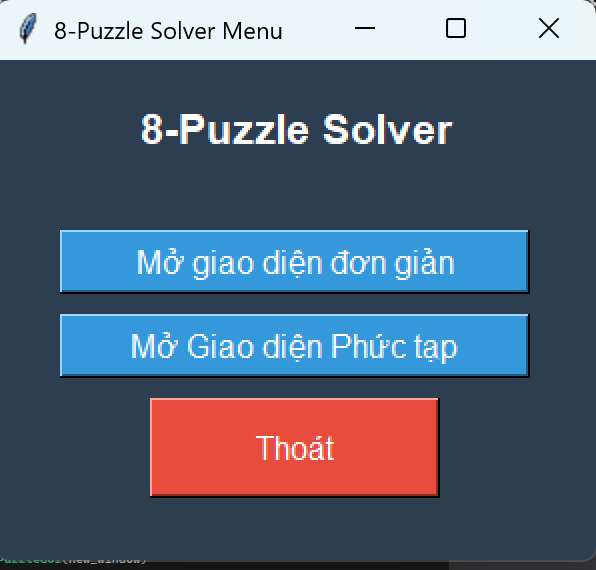
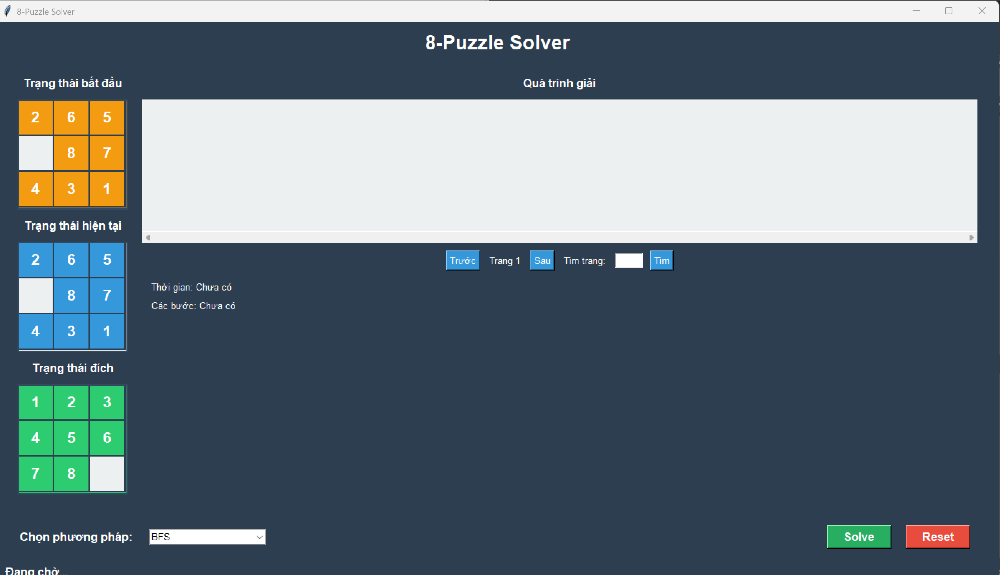
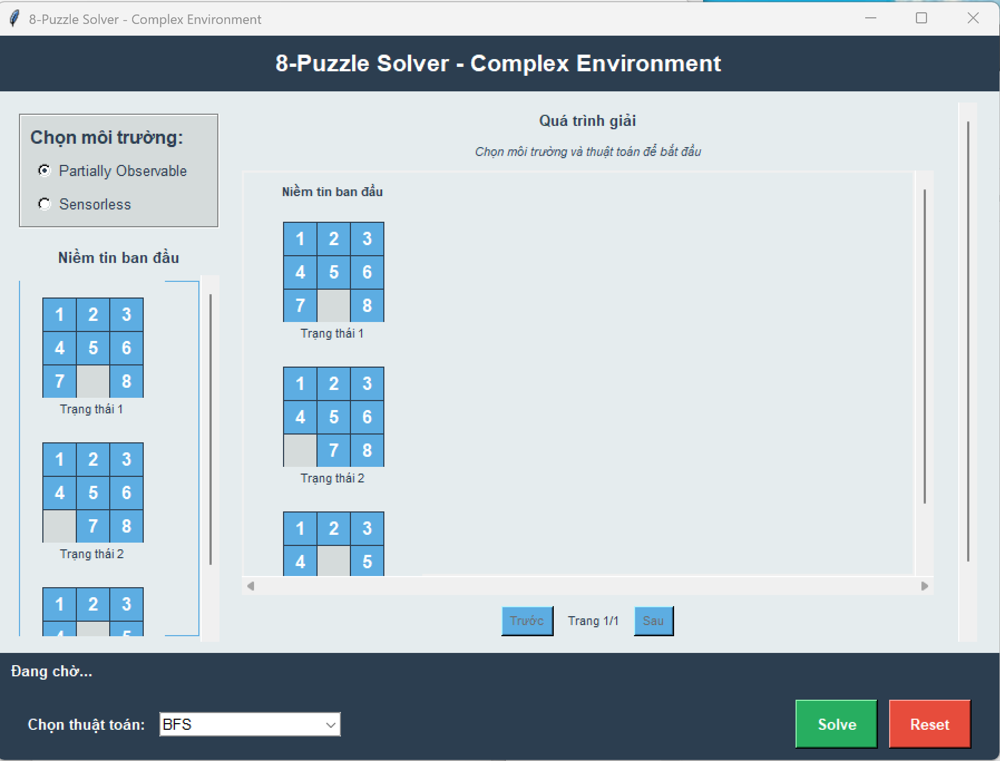
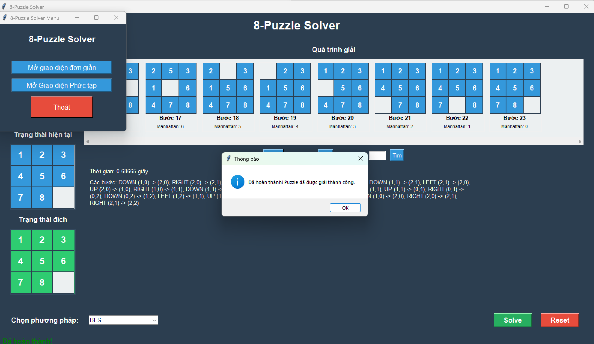

# Báo Cáo : Ứng Dụng Thuật Toán Tìm Kiếm trong Giải 8-Puzzle
## **Phần 1. Mở Đầu**
### 1.1. Lời Nói Đầu
Sự phát triển vượt bậc của công nghệ thông tin đã đưa trí tuệ nhân tạo (AI) trở thành công cụ then chốt trong việc giải quyết các bài toán phức tạp, từ điều hướng robot đến lập kế hoạch thông minh. Thuật toán tìm kiếm, một trụ cột của AI, cho phép hệ thống tự động đưa ra quyết định, tìm đường đi tối ưu, và giải các bài toán ràng buộc. 8-Puzzle, một trò chơi giải đố cổ điển với không gian trạng thái lớn (362.880 cấu hình, 1/2 khả thi), là mô hình lý tưởng để nghiên cứu và đánh giá các thuật toán tìm kiếm trong việc tìm đường đi tối ưu dưới các ràng buộc và môi trường đa dạng.

Đề tài **“Ứng dụng thuật toán tìm kiếm trong giải 8-Puzzle”** tập trung nghiên cứu, triển khai, và đánh giá hiệu quả của sáu nhóm thuật toán tìm kiếm, từ đó áp dụng vào các bài toán thực tế như lập kế hoạch di chuyển robot trong không gian hạn chế. Báo cáo này trình bày quá trình phát triển hệ thống, kết quả thực nghiệm, phân tích hiệu suất, và định hướng phát triển trong tương lai.

**Kết quả cần đạt:**
Hệ thống ứng dụng: Chương trình tự động giải 8-Puzzle từ trạng thái nhập vào, sử dụng sáu nhóm thuật toán, hiển thị chi tiết các bước di chuyển, và cung cấp thông tin so sánh về thời gian chạy, số bước di chuyển, và bộ nhớ sử dụng.
Công nghệ ứng dụng: Áp dụng thuật toán tìm kiếm vào bài toán thực tế với không gian trạng thái lớn và nhiều ràng buộc logic, sử dụng Python 3.12 và Tkinter để xây dựng giao diện trực quan hóa dữ liệu.

### 1.2. Mục Tiêu
Đề tài nhằm nghiên cứu, triển khai, và đánh giá hiệu quả của các thuật toán tìm kiếm trong bài toán 8-Puzzle, với các mục tiêu cụ thể:
Phân tích đặc điểm của 8-Puzzle: không gian trạng thái, số đảo ngược, khoảng cách Manhattan, ràng buộc di chuyển, và các môi trường (bao gồm Partially Observable và Sensorless).
Nghiên cứu và triển khai sáu nhóm thuật toán tìm kiếm:
Tìm kiếm có thông tin: A*, Greedy Best-First Search, IDA*.
Tìm kiếm không thông tin: Breadth-First Search (BFS), Depth-First Search (DFS), Iterative Deepening Search (IDS), Uniform Cost Search (UCS).
Tìm kiếm ràng buộc: Backtracking, Backtracking with Forward Checking (FC), Min-Conflicts.
Tìm kiếm học tăng cường: Q-Learning.
Tìm kiếm cục bộ: Hill Climbing, Steepest Ascent Hill Climbing, Stochastic Hill Climbing, Beam Search, Genetic Algorithm, Simulated Annealing.
Tìm kiếm trong môi trường phức tạp: Partially Observable Search, Sensorless Search, And-Or Search.
So sánh hiệu suất các thuật toán dựa trên thời gian tìm kiếm, số bước di chuyển, khả năng tìm giải pháp tối ưu, và mức tiêu thụ tài nguyên (bộ nhớ, CPU).

### 1.3. Phạm Vi và Đối Tượng
**Phạm vi:**
Đề tài được thực hiện trong một học kỳ, bao gồm các giai đoạn: tìm hiểu bài toán, nghiên cứu thuật toán, thiết kế hệ thống, lập trình mô phỏng, thu thập kết quả, và viết báo cáo.
Tập trung vào 8-Puzzle 2D với trạng thái ban đầu do người dùng nhập hoặc sinh ngẫu nhiên, thuộc lĩnh vực AI, cụ thể là tìm kiếm trong không gian trạng thái. Các trạng thái thử nghiệm có độ phức tạp tăng dần (dựa trên số đảo ngược và khoảng cách Manhattan).
Sử dụng Python 3.12 và Tkinter để xây dựng giao diện trực quan, cho phép quan sát quá trình tìm kiếm và mô phỏng các bước di chuyển, đặc biệt trong các môi trường phức tạp như Partially Observable và Sensorless.
**Đối tượng: **
Sáu nhóm thuật toán tìm kiếm được chọn do sự đa dạng về chiến lược, ưu/nhược điểm, và khả năng áp dụng cho 8-Puzzle – một bài toán tìm đường với không gian trạng thái lớn và nhiều ràng buộc di chuyển.
Đối tượng sử dụng: Sinh viên học môn Trí tuệ nhân tạo, lập trình viên quan tâm đến trò chơi giải đố, và các nhà nghiên cứu AI muốn phân tích hiệu quả thuật toán tìm kiếm.
Đề tài nhấn mạnh trực quan hóa quá trình tìm kiếm, đặc biệt trong các môi trường phức tạp, để minh họa, phân tích, và so sánh hiệu quả thuật toán.

### 1.4. Phương Pháp Nghiên Cứu
**Thu thập thông tin:** Nghiên cứu tài liệu về AI, thuật toán tìm kiếm, và mô hình hóa 8-Puzzle dưới dạng không gian trạng thái. Khảo sát các chương trình mã nguồn mở liên quan để định hướng triển khai.
**Xử lý thông tin:**
Phân tích định tính: So sánh đặc điểm lý thuyết, chiến lược, ưu/nhược điểm, và yêu cầu tài nguyên của các thuật toán.
Phân tích định lượng: Đánh giá hiệu quả qua dữ liệu thực nghiệm (thời gian, số bước, bộ nhớ).
**Thực nghiệm:** Mô phỏng 8-Puzzle bằng Python và Tkinter, cho phép chọn thuật toán, nhập trạng thái, và giải tự động. Thực nghiệm trên các trạng thái với độ phức tạp tăng dần để đánh giá hiệu suất và khả năng áp dụng

## Danh sách hình vẽ
Hình 1: Giao diện trò chơi 8-Puzzle

Hình 2: Giao diện màn hình giải 8-Puzzle

Hình 3: Giao diện màn hình kết thúc

## **Phần 2. Cơ sở Lý Thuyết**
### 2.1. Tổng Quan về Trí Tuệ Nhân Tạo
Trí tuệ nhân tạo (AI) là lĩnh vực khoa học máy tính nghiên cứu xây dựng các hệ thống thực hiện nhiệm vụ đòi hỏi trí thông minh con người, bao gồm học hỏi, suy luận, nhận thức, giải quyết vấn đề, và ra quyết định. Các nhánh chính của AI:
Tìm kiếm và giải quyết vấn đề: Phát triển thuật toán tìm giải pháp tối ưu trong không gian trạng thái phức tạp.
Biểu diễn tri thức: Lưu trữ và xử lý thông tin để hỗ trợ suy luận
Học máy: Xây dựng mô hình tự cải thiện qua dữ liệu.
Quy hoạch và ra quyết định: Lập kế hoạch hành động dài hạn để đạt mục tiêu.

### 2.2. Tổng Quan về 8-Puzzle
8-Puzzle là trò chơi giải đố trên lưới 3x3, gồm 8 ô số (1-8) và 1 ô trống (0). Người chơi di chuyển ô trống lên, xuống, trái, hoặc phải để sắp xếp các ô số về trạng thái mục tiêu (thường là [[1, 2, 3], [4, 5, 6], [7, 8, 0]]).
Độ phức tạp: Không gian trạng thái có 9! = 362.880 cấu hình, nhưng chỉ một nửa là khả thi (dựa trên tính chẵn của số đảo ngược).
Ràng buộc: Ô trống chỉ di chuyển đến các ô liền kề trong lưới.
Đặc điểm: Thuộc lớp bài toán NP-Hard, độ khó tăng khi mở rộng sang các môi trường phức tạp như Partially Observable (thông tin không đầy đủ) hoặc Sensorless (không quan sát được trạng thái).

### 2.3. Cấu Trúc Bài Toán Tìm Kiếm
Bài toán tìm kiếm trong AI bao gồm:
Không gian trạng thái: Tập hợp các trạng thái, biểu diễn dưới dạng đồ thị (đỉnh là trạng thái, cạnh là hành động).
Trạng thái ban đầu: Điểm xuất phát của bài toán.
Phép chuyển trạng thái: Các hành động khả thi  chuyển từ trạng thái này sang trạng thái khác.
Mô hình chuyển đổi: Kết quả của hành động .
Kiểm tra mục tiêu: Xác định trạng thái mục tiêu .
Chi phí đường đi: Tổng chi phí các hành động (g(n)).

### 2.4. Bài Toán 8-Puzzle Dưới Góc Nhìn Thuật Toán
8-Puzzle là bài toán tìm kiếm trong không gian trạng thái có ràng buộc, yêu cầu lập kế hoạch chuỗi hành động hợp lệ từ trạng thái ban đầu đến mục tiêu.
Trạng thái: Ma trận 3x3 (list[list[int]]), ví dụ: [[2, 8, 3], [1, 6, 4], [7, 0, 5]].
Ràng buộc: Ô trống chỉ di chuyển đến ô liền kề (lên, xuống, trái, phải).
Môi trường phức tạp:
Partially Observable: Chỉ biết một phần thông tin (ví dụ: vị trí ô trống nhưng không biết vị trí các ô số), yêu cầu quản lý tập niềm tin.
Sensorless: Không biết trạng thái hiện tại, cần đồng bộ tập niềm tin về trạng thái mục tiêu.
And-Or Search: Xử lý các trạng thái hoặc hành động không xác định, mô phỏng môi trường ngẫu nhiên.